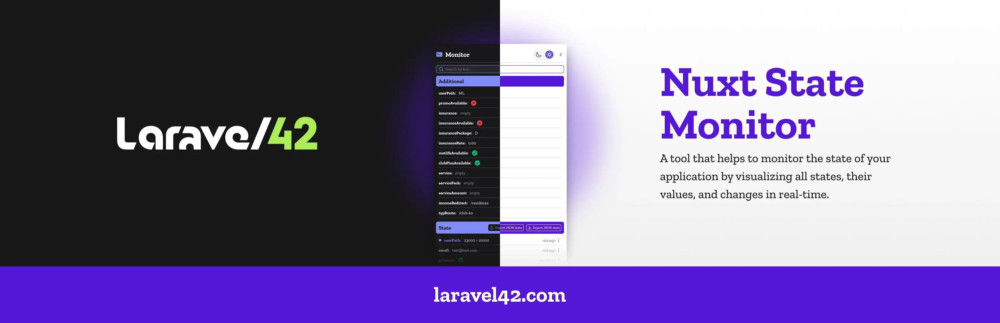

<!--
Get your module up and running quickly.

Find and replace all on all files (CMD+SHIFT+F):
- Name: Nuxt State Monitor
- Package name: nuxt-state-monitor
- Description: Real-time monitoring of Nuxt native states
-->

# Nuxt State Monitor



[![npm version][npm-version-src]][npm-version-href]
[![npm downloads][npm-downloads-src]][npm-downloads-href]
[![License][license-src]][license-href]
[![Nuxt][nuxt-src]][nuxt-href]


# Nuxt State Monitor


**Nuxt State Monitor** is a lightweight Nuxt module that allows you to monitor and edit all variables stored in Nuxt's native state, including custom data of any type. This is useful for debugging, managing state, and keeping track of custom runtime data in a seamless and developer-friendly way.

## Features

- 📊 **State Monitoring**: Real-time monitoring of all Nuxt native states.
- 🔧 **State Editing**: Dynamically edit the state directly from the UI.
- 🔍 **Custom Data Monitoring**: Watch and manage custom data objects and variables.
- ⚡ **Zero Configuration**: Minimal setup and configuration needed.
- 💻 **Developer-Friendly UI**: A sleek and intuitive UI to track and manage states.

## Requirements

- Nuxt 3.x
- Vue 3.x

## Installation

``` 
npx nuxi@latest module add nuxt-state-monitor
```

Update your ```nuxt.config```:

  ```
  export default defineNuxtConfig({
    modules: [
      'nuxt-state-monitor'
    ]
  })
  ```

## Usage

Add the component in App.vue to enable monitor everywhere, or in single pages if you want to monitor specific views

```<NuxtStateMonitor custom-data="additional"/>```

## Requirements

- Nuxt 3.x
- Vue 3.x

## License

This repository is licensed under the [MIT License](LICENSE). Feel free to use the code and modify it according to your needs.

## Contacts

🔖 **Mail**: hello@laravel42.com

## License

[MIT](./LICENSE) - Made with 💚 by [Laravel42](https://laravel42.com)

